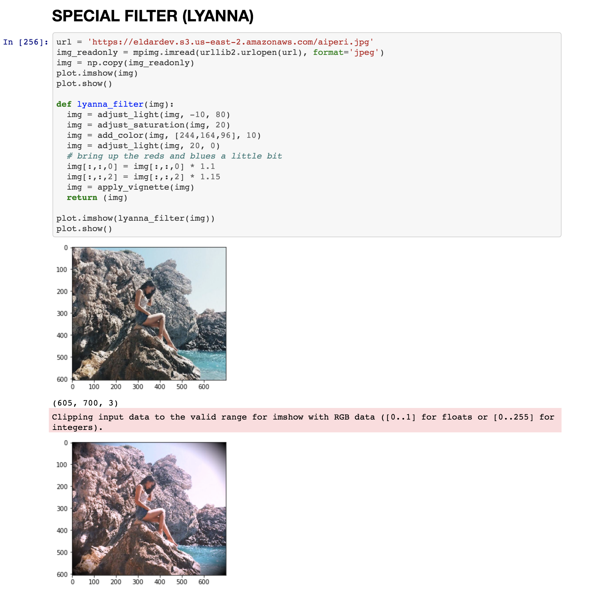

# Numpy Rush Project
### Learning how to make Instagram Filters using Python's NumPy and MatPlotLib libraries

The gist of this 2 day Rush Project was to learn about NumPy and MatPlotLib

```python
import urllib.request as urllib2
import numpy as np
import matplotlib as matplot
import matplotlib.pyplot as plot
import matplotlib.image as mpimg
import matplotlib.colors as mpcolors
```

Seems like the main idea behind this project was to do some mathematical manipulations with matrices and I might have went the wrong way.

Having been exposed to working with photography and videography, I was familiar with different color spaces besides **`RGB`** such as **`HSL, HSV, CMYK, HEX etc`**. Just out of curiousity, I found out that **matplotlib** had a sub-library called `colors`, which can be used to convert the **img** matrix from RGB to HSV. It gives more freedom to operate with such values as `Saturation` and `Brightness`.

#### Reading from the Image
It's just a very basic code to read the image file. **`imread`** automatically supports `PNG` format. For all other formats, you have to specify. 
```python
url = 'https://eldardev.s3.us-east-2.amazonaws.com/liana.jpg'
img_readonly = mpimg.imread(urllib2.urlopen(url), format='jpeg')
img = np.copy(img_readonly)
plot.imshow(img)
plot.show()
```

I wrote several generic functions to be used in all of my filters:

#### Adjust Saturation
This functions takes the **`img`** matrix, converts it to HSV and adjusts the Saturation by **`perc`** value. 
```python
def adjust_saturation(img, perc):
  img_hsv = mpcolors.rgb_to_hsv(img)
  for i in range(0, img_hsv.shape[0]):
    for j in range(0, img_hsv.shape[1]):
        img_hsv[i,j,1] = img_hsv[i,j,1] * ((100 + perc) / 100)
  img = mpcolors.hsv_to_rgb(img_hsv)
  img = img.astype(int)
  return (img)
```

#### Adjust Brightness
This functions takes the **`img`** matrix, converts it to HSV and adjusts the Brightness by **`perc`** value. I also had to include the **`threshold`** variable. Some filters wanted to `bring up the brights`, so you want to separate your brights from the rest.
```python
def adjust_light(img, perc, threshold):
  img_hsv = mpcolors.rgb_to_hsv(img)
  for i in range(0, img_hsv.shape[0]):
    for j in range(0, img_hsv.shape[1]):
      if (img_hsv[i,j,2] > (threshold / 100.)):
        img_hsv[i,j,2] = img_hsv[i,j,2] * ((100 + perc) / 100)
  img = mpcolors.hsv_to_rgb(img_hsv)
  img = img.astype(int)
  return (img)
```

#### Add Color
This functions takes the **`img`** matrix and applies the `color` (passed as an RGB value, eg. [255, 122, 34]) value with the `perc` intensity. Basically, all the pixels in the image are moving towards that color. You determine if the just move 15% of the way or all 100%)).
```python
def add_color(img, color, perc):
  for i in range(0, img.shape[0]):
    for j in range(0, img.shape[1]):
      for k in range(0, img.shape[2]):
        diff = color[k] - img[i,j,k]
        img[i,j,k] = img[i,j,k] + diff * perc / 100
  img = img.astype(int)
  return (img)
```

#### Apply Vignette
This function applies the **`vignette`** effect. For this, I had to remember the formula of the ellipse which is
```math
(x^2)/(a^2) + (y^2)/(b^2) = 1
```
So, in my case, I wanted to modify only pixels that were outside this ellipse. Therefore, I checked if this formula was **`>1`**. Also, make sure you move the **x** and the **y** to the middle of your image.

```python
def apply_vignette(img):
  img_hsv = mpcolors.rgb_to_hsv(img)
  center_x = img.shape[0] / 2
  center_y = img.shape[1] / 2
  for i in range(0, img_hsv.shape[0]):
    for j in range(0, img_hsv.shape[1]):
      diff = ((i - center_x)**2) / (center_x**2) + ((j - center_y)**2) / (center_y**2)
      if (diff > 0.95):
        img_hsv[i,j,2] = img_hsv[i,j,2] * (1 - (diff - 0.95)**(1.2))
  img = mpcolors.hsv_to_rgb(img_hsv)
  img = img.astype(int)
  return (img)
```
### Example
To see more, just open the **`Rush - Part II`** file. GitHub will automatically load it and run it for you, which is really nice!!

